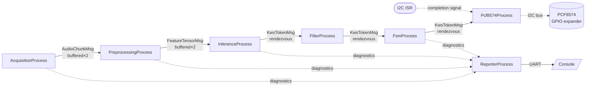
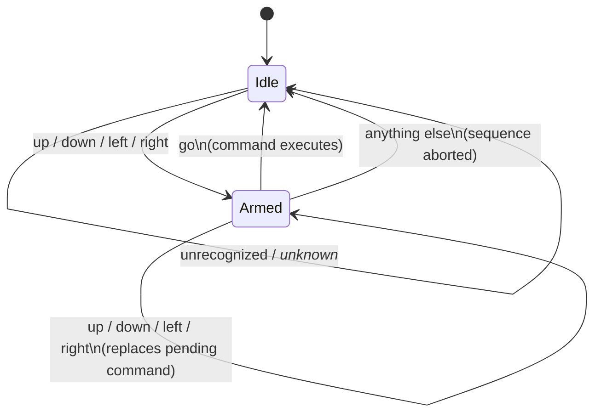

# CSP4CMSIS-based Keyword Spotting with Hardware Actuation

Keyword Spotting (KWS) detects specific spoken words within a continuous audio stream, typically in low-power, always-on settings. This app uses ARM's [Keyword Transformer](https://www.isca-archive.org/interspeech_2021/berg21_interspeech.pdf) model to run KWS on the Himax WE2 (Cortex-M55 + Ethos-U55 NPU), and goes one step further than plain classification: recognized voice commands are turned into physical outputs on a **PCF8574 I2C GPIO expander** — say a direction, confirm it, and watch a port toggle.

Audio preprocessing follows ARM's [ml-embedded-evaluation-kit](https://review.mlplatform.org/plugins/gitiles/ml/ethos-u/ml-embedded-evaluation-kit/+/refs/tags/22.02/docs/use_cases/kws.md) approach: raw audio → MFCC features → NPU inference.

---

## 🚀 Concurrency with CSP4CMSIS

The app is a **seven-process CSP network** built with [CSP4CMSIS](https://oliverfaust.github.io/CSP4CMSIS/)'s Communicating Sequential Processes model on top of FreeRTOS. Each process is an independent, statically-allocated task communicating exclusively through typed channels — no shared mutable state, no manual locking. Six of the seven form the active audio-to-actuation pipeline; the seventh (`ReporterProcess`) is a diagnostic sink that sits off to the side so console I/O can never stall the pipeline.

| Process | Responsibility |
|---|---|
| **AcquisitionProcess** | Owns the PDM/DMA ring buffer; hands off each freshly-completed audio segment as soon as it's safe to read (one slot behind the DMA's actively-writing index). |
| **PreprocessingProcess** | Maintains a persistent, incrementally-updated MFCC feature tensor, shifting in new frames each cycle, double-buffered against Inference. |
| **InferenceProcess** | Copies the completed tensor into the model's input, runs the Ethos-U55 NPU via `Invoke()`, and classifies the result. |
| **FilterProcess** | Drops `_unknown_` classifications and collapses consecutive duplicate labels, so a held-down keyword doesn't flood the FSM with repeats. |
| **FsmProcess** | Interprets the filtered keyword stream as two-word commands (`<direction> go`) and drives the hardware channel — see [Voice Command Interaction](#-voice-command-interaction) below. |
| **Pcf8574Process** | Owns the I2C bus; translates a confirmed FSM command into a port write on the PCF8574 expander. |
| **ReporterProcess** | Owns all UART/console output via a lossy, non-blocking channel, so a burst of print activity can never propagate backpressure into the acquisition/inference path. |

### Process Network Diagram



`AcquisitionProcess → PreprocessingProcess` and `PreprocessingProcess → InferenceProcess` are **depth-2 buffered channels**, giving a little slack for pipelining. `InferenceProcess → FilterProcess → FsmProcess → Pcf8574Process` are **zero-capacity rendezvous channels** — each stage blocks until the next is ready, so a downstream stall (e.g. a slow I2C write) correctly back-pressures all the way to Acquisition rather than silently dropping data. All diagnostic/status output funnels into `ReporterProcess` through a **lossy, buffered channel** (`SamplingBufferedChannel`, keep-newest policy), which is intentionally the *only* lossy link in the network.

### Task Priorities

FreeRTOS on this build is configured with `configMAX_PRIORITIES = 5`, so every task priority must stay in **`tskIDLE_PRIORITY + 0` through `+4`** — going out of range trips `configASSERT` inside `xTaskCreate` silently (no crash message, task just never starts). Priorities decrease monotonically along the data-flow direction, and the task that constructs the network (`MainApp_Task`) is created at a priority **at or above** every child's, so none of them can preempt it mid-construction:

| Task | Priority |
|---|---|
| `MainApp_Task` (network construction) | `+4` |
| `AcquisitionProcess` | `+4` |
| `PreprocessingProcess` | `+3` |
| `InferenceProcess` | `+2` |
| `FilterProcess` / `FsmProcess` | `+1` |
| `ReporterProcess` / `Pcf8574Process` | `+0` |

---

## 🎮 Voice Command Interaction

Commands are spoken as **two words**: a direction, then `"go"` to confirm it. This two-step pattern exists specifically to avoid a stray, low-confidence classification accidentally firing an output — a single misheard word can never trigger hardware on its own.



**Example interaction:**

> *"left"* → FSM arms, remembers `left`, no output yet
> *"go"* → FSM confirms, sends `left` to the hardware controller, prints `[FSM] Executing Command Console Output: left`, PCF8574 port state becomes `0x04`, FSM returns to Idle

If you change your mind mid-sequence, just say a new direction — it silently replaces the pending one without needing to abort first:

> *"up"* → armed with `up`
> *"down"* → still armed, now with `down` (no abort message)
> *"go"* → executes `down`

Saying anything else while armed (`yes`, `no`, `stop`, `on`, `off`, or any other recognized-but-irrelevant word) cancels the pending command and prints `[FSM] Sequence aborted! Returning to Idle.`. `_unknown_` classifications and repeated identical words are filtered out before they ever reach the FSM, so background noise and held keywords don't affect state at all.

### Command → Hardware Mapping

| Spoken command | PCF8574 port bits | Port value |
|---|---|---|
| `up` | P0 | `0x01` |
| `down` | P1 | `0x02` |
| `left` | P2 | `0x04` |
| `right` | P3 | `0x08` |

All ports are initialized to `0x00` at startup (`[PCF8574] Initializing all ports to 0...`). Only `up`/`down`/`left`/`right` are wired to an output — `yes`, `no`, `on`, `off`, and `stop` are recognized by the model but have no hardware effect; they only serve to abort an armed sequence if spoken instead of `go`.

### Recognized Vocabulary

The model classifies 12 labels: `_silence_`, `_unknown_`, `yes`, `no`, `up`, `down`, `left`, `right`, `on`, `off`, `stop`, `go`. A classification is only reported at all if its confidence is **≥ 70%**.

---

## 🔧 Key Code Snippets

### Safe buffer selection (`csp4cmsis_spn.cpp`)
The DMA ISR increments `w_buf_idx` and immediately starts filling that new slot — so the buffer that's actually safe to read is always one slot *behind* the live index, not the live index itself:
```cpp
// DMA ISR: w_buf_idx++ then immediately re-arms DMA into audio_buf[w_buf_idx]
int32_t current_buf = (observedWBufIdx + NUM_BUFF - 1) % NUM_BUFF;
```

### FSM two-word confirmation (`csp4cmsis_spn.cpp`)
```cpp
if (state == State::Idle) {
    if (isDirection(msg.label)) { savedCommand = msg.label; state = State::Go; }
} else if (state == State::Go) {
    if (msg.label == "go") {
        out_hw << KwsTokenMsg{savedCommand};   // execute
        state = State::Idle;
    } else if (isDirection(msg.label)) {
        savedCommand = msg.label;              // replace pending command
    } else {
        out_report << FsmAbort{};              // cancel
        state = State::Idle;
    }
}
```

### PCF8574 write with ISR-driven completion (`csp4cmsis_spn.cpp`)
```cpp
void write_port(uint8_t val) {
    hx_drv_i2cm_interrupt_write(USE_DW_IIC_0, slave_addr, &val, 1, (void *)pcf_i2c_callback);
    i2c_sync >> dummy;   // blocks until the I2C ISR fires pcf_i2c_callback()
}
```

---

## Sample Console Output

```text
--- KWS Pipeline starting (incl. PCF8574 I2C control) ---
Preprocessing state initialised: tensor_bytes=3920 type=9
[PCF8574] Initializing all ports to 0...
Preprocessing: priming step 1/1 (window not yet fully real)
[Acq]  Missed 0/20 | ms: dma_wait=9682 buf_asm=0 chan_send_wait=0 | elapsed=9684ms rtf=1.03
[DMA]  cb_count=19 avg_interval=512ms (ground truth, ISR-measured)
[Mem]  free_heap=219248 min_ever_free=185040 | stack_hwm(words): prep=0 infer=0
[Prep] Processed 20 | ms: mfcc=143 chan_send_wait=1 | elapsed=9694ms rtf=1.03
[Inf]  Processed 20 | ms: copy=0 invoke=4800 post=0 | elapsed=10443ms rtf=0.95
[Sem]  take=980 give=1960
Label: left Score: 90 % Label Index: 6
Label: go Score: 88 % Label Index: 11
[FSM] Executing Command Console Output: left
[PCF8574] Switched port state to 0x04 for command: left
```

---

## 📁 File Structure

```text
app/scenario_app/csp4cmsis_kws_iic/
├── csp4cmsis_kws_iic.c     // PDM/DMA driver glue, ring-buffer ISR callback
├── csp4cmsis_kws_iic.h     // Ring-buffer sizing (BLK_NUM, NUM_BUFF, AUDIO_LEN)
├── cvapp_kws.cpp           // Model init, MFCC, Invoke(), label table
├── cvapp_kws.h             // cv_kws_* API, timing globals
├── csp4cmsis_spn.cpp       // The 7 CSP processes + network construction
├── csp4cmsis_spn.h         // Reporting API shared across processes
└── ethosu_rtos_semaphore.c // FreeRTOS-backed semaphore for the Ethos-U55 IRQ
```

## 🐛 Troubleshooting

* **Everything goes silent, immediately, right after task creation, with no crash output** — a `taskPriority()` override (or `MainApp_Task`'s own creation priority) is `≥ configMAX_PRIORITIES`. This build has `configMAX_PRIORITIES = 5`, so the valid range is `tskIDLE_PRIORITY + 0` through `+4`. Out-of-range values trip `configASSERT` inside `xTaskCreate` before the task runs a single instruction — grep your `FreeRTOSConfig.h` to confirm the ceiling on your build.
* **All processes go silent together after running fine for a while, with no crash output** — a downstream stage is blocked forever on an un-timed-out wait, and its unbuffered channel is back-pressuring the whole chain. `Pcf8574Process::wait_for_i2c_isr()` has no timeout and no I2C error callback; a single bus NACK or glitch leaves it blocked indefinitely, which then blocks `FsmProcess` → `FilterProcess` → `InferenceProcess` → the buffered channels behind them, in that order. Add a bounded wait and an error path to any ISR-driven completion signal on the critical path.
* **A process never runs at a priority higher than the task that constructs the network** — CSP4CMSIS's `Run(InParallel(...))` creates child tasks one at a time from the calling task. A child priority *strictly greater* than the constructor's own priority triggers an immediate preemption, which can stall construction of the remaining processes indefinitely. Keep the constructing task's priority ≥ every child's.
* **Reporter process never prints anything, but the app doesn't crash** — priority/stack starvation of a low-priority process. Use `vTaskDelay(1)`, not `taskYIELD()` (which only rotates same-priority tasks), in any polling loop on a higher-priority process.
* **Timing measurements wrap to a huge (~4 billion) value** — a raw `SysTick`-based cycle counter was used across a genuine RTOS blocking wait. Use `xTaskGetTickCount()`/`portTICK_PERIOD_MS` for any measurement spanning a blocking call.
* **Classification results look wrong / model seems to be fed stale audio** — check that `BLK_NUM` (in `csp4cmsis_kws_iic.h`) and `current_buf`'s one-slot-behind offset agree on which buffer the DMA has actually finished writing.
* **Build fails or asserts inside `fully_connected_common.cc`** — this app compiles with `-DCSP4CMSIS_KWS_IIC`. Extend the existing symmetric-quantization guard in `library/inference/<tflm_tag>/tensorflow/lite/micro/kernels/fully_connected_common.cc` to include it:
    ```cpp
    #if defined(KWS_PDM_RECORD) || defined(CSP4CMSIS_KWS_IIC)
    #else
      TFLITE_DCHECK(filter->params.zero_point == 0);
    #endif
    ```

## Building and Running on WE2

1. Apply the `fully_connected_common.cc` patch above.
2. Set `APP_TYPE = csp4cmsis_kws_iic` in the [Makefile](https://github.com/HimaxWiseEyePlus/Seeed_Grove_Vision_AI_Module_V2/blob/main/EPII_CM55M_APP_S/makefile).
3. Build the firmware per [Building the Firmware in a Linux Environment](https://github.com/HimaxWiseEyePlus/Seeed_Grove_Vision_AI_Module_V2?tab=readme-ov-file#build-the-firmware-at-linux-environment).
4. Flash it (see [Flashing Image Updates](https://github.com/HimaxWiseEyePlus/Seeed_Grove_Vision_AI_Module_V2?tab=readme-ov-file#flash-image-update-at-linux-environment-by-python-code)):
    ```bash
    python3 xmodem/xmodem_send.py --port=/dev/ttyACM0 --baudrate=921600 --protocol=xmodem --file=we2_image_gen_local/output_case1_sec_wlcsp/output.img --model="model_zoo/kws_pdm_record/kwt1_relu_mfcc_fvp_aligned_vela.tflite 0xB7B000 0x00000"
    ```
5. Wire a PCF8574 to the WE2's I2C0 bus (default address `0x20`; use `0x38` for a PCF8574A).
6. Press `reset` and try saying a direction followed by `"go"`.

## 📝 License
This example is provided under the standard Himax SDK license terms. Refer to the top-level license file in the SDK for details.
