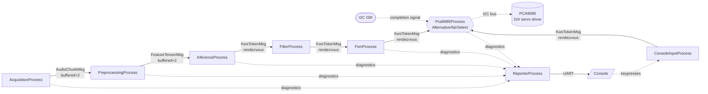
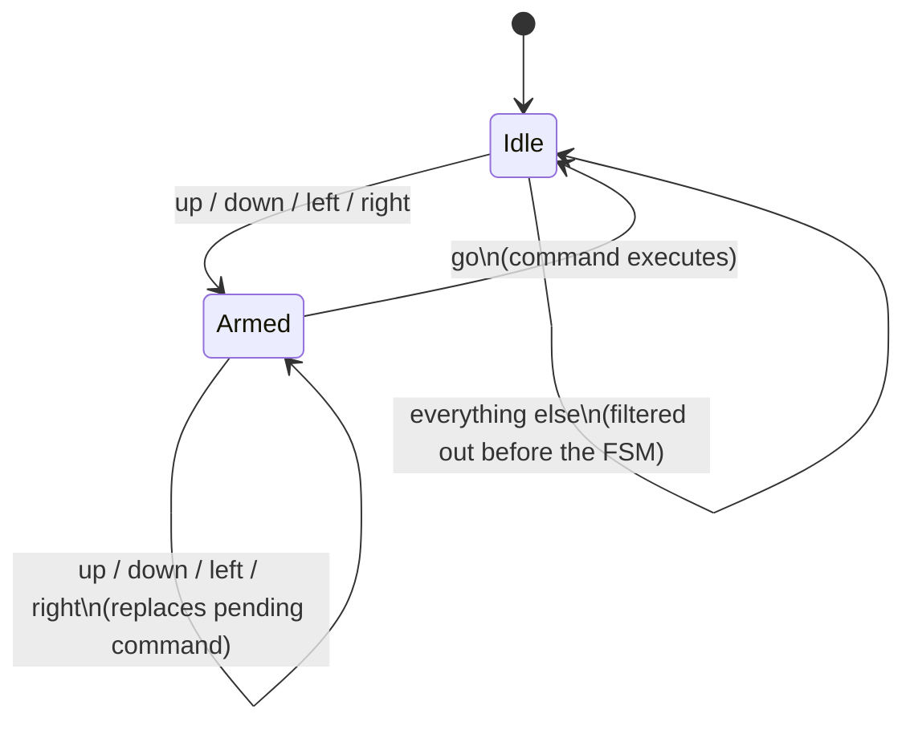

# CSP4CMSIS-based Keyword Spotting with Hardware Actuation

Keyword Spotting (KWS) detects specific spoken words within a continuous audio stream, typically in low-power, always-on settings. This app uses ARM's [Keyword Transformer](https://www.isca-archive.org/interspeech_2021/berg21_interspeech.pdf) model to run KWS on the Himax WE2 (Cortex-M55 + Ethos-U55 NPU), and goes one step further than plain classification: recognized voice commands drive two channels of a **PCA9685 16-channel, 12-bit PWM I2C servo driver** — say a direction, confirm it, and watch a servo step one position. A second, independent control path is available too: **WASD keypresses on the console** drive the same two servo channels directly, no voice confirmation needed.

Audio preprocessing follows ARM's [ml-embedded-evaluation-kit](https://review.mlplatform.org/plugins/gitiles/ml/ethos-u/ml-embedded-evaluation-kit/+/refs/tags/22.02/docs/use_cases/kws.md) approach: raw audio → MFCC features → NPU inference.

---

## 🚀 Concurrency with CSP4CMSIS

The app is an **eight-process CSP network** built with [CSP4CMSIS](https://oliverfaust.github.io/CSP4CMSIS/)'s Communicating Sequential Processes model on top of FreeRTOS. Each process is an independent, statically-allocated task communicating exclusively through typed channels — no shared mutable state, no manual locking. Seven of the eight form the active audio-to-actuation pipeline plus the console input path; the eighth (`ReporterProcess`) is a diagnostic sink that sits off to the side so console I/O can never stall the pipeline.

| Process | Responsibility |
|---|---|
| **AcquisitionProcess** | Owns the PDM/DMA ring buffer; hands off each freshly-completed audio segment as soon as it's safe to read (one slot behind the DMA's actively-writing index). |
| **PreprocessingProcess** | Maintains a persistent, incrementally-updated MFCC feature tensor, shifting in new frames each cycle, double-buffered against Inference. |
| **InferenceProcess** | Copies the completed tensor into the model's input, runs the Ethos-U55 NPU via `Invoke()`, and classifies the result. |
| **FilterProcess** | Restricts the stream to the command vocabulary (`up`, `down`, `left`, `right`, `go`) — everything else (`_silence_`, `_unknown_`, `yes`, `no`, `on`, `off`, `stop`) is dropped here — and collapses consecutive duplicate labels, so a held-down keyword doesn't flood the FSM with repeats. |
| **FsmProcess** | Interprets the filtered keyword stream as two-word commands (`<direction> go`) and drives the hardware channel — see [Voice Command Interaction](#-voice-command-interaction) below. |
| **ConsoleInputProcess** | Polls the console UART for `w`/`a`/`s`/`d` keypresses and turns them straight into direction commands — a second, independent command source for the hardware channel; see [Console Keypress Interaction](#-console-keypress-interaction) below. |
| **Pca9685Process** | Owns the I2C bus; arbitrates between the confirmed FSM command stream and the raw console keypress stream via a CSP `Alternative`/`fairSelect()`, and translates whichever wins into a PWM pulse-width update on one of two PCA9685 servo channels. |
| **ReporterProcess** | Owns all UART/console output via a lossy, non-blocking channel, so a burst of print activity can never propagate backpressure into the acquisition/inference path. |

### Process Network Diagram



`AcquisitionProcess → PreprocessingProcess` and `PreprocessingProcess → InferenceProcess` are **depth-2 buffered channels**, giving a little slack for pipelining. `InferenceProcess → FilterProcess → FsmProcess → Pca9685Process` and `ConsoleInputProcess → Pca9685Process` are all **zero-capacity rendezvous channels** — each stage blocks until the next is ready, so a downstream stall (e.g. a slow I2C write) correctly back-pressures all the way to Acquisition rather than silently dropping data. `Pca9685Process` is the one point where two independent rendezvous channels feed a single consumer: it holds `Alternative alt(in_hw | voiceCmd, in_console | consoleCmd)` and calls `alt.fairSelect()` each iteration, so a held key can't starve a pending voice command and vice versa. All diagnostic/status output — including `Pca9685Process`'s own, which no longer calls `xprintf()` directly — funnels into `ReporterProcess` through a **lossy, buffered channel** (`SamplingBufferedChannel`, keep-newest policy), which is intentionally the *only* lossy link in the network.

### Task Priorities

FreeRTOS on this build is configured with `configMAX_PRIORITIES = 5`, so every task priority must stay in **`tskIDLE_PRIORITY + 0` through `+4`** — going out of range trips `configASSERT` inside `xTaskCreate` silently (no crash message, task just never starts). Priorities decrease monotonically along the data-flow direction, and the task that constructs the network (`MainApp_Task`) is created at a priority **at or above** every child's, so none of them can preempt it mid-construction:

| Task | Priority |
|---|---|
| `MainApp_Task` (network construction) | `+4` |
| `AcquisitionProcess` | `+4` |
| `PreprocessingProcess` | `+3` |
| `InferenceProcess` | `+2` |
| `FilterProcess` / `FsmProcess` / `ConsoleInputProcess` | `+1` |
| `ReporterProcess` / `Pca9685Process` | `+0` |

---

## 🎮 Voice Command Interaction

Commands are spoken as **two words**: a direction, then `"go"` to confirm it. This two-step pattern exists specifically to avoid a stray, low-confidence classification accidentally firing an output — a single misheard word can never trigger hardware on its own.



**Example interaction:**

> *"left"* → FSM arms, remembers `left`, no output yet
> *"go"* → FSM confirms, sends `left` to the hardware controller, prints `[FSM] Executing Command Console Output: left`, channel 1's servo steps from `Middle` to `Half Left`, log shows `[PCA9685/voice] Ch1 -> Half Left (1/4)`

If you change your mind mid-sequence, just say a new direction — it silently replaces the pending one without needing to abort first:

> *"up"* → armed with `up`
> *"down"* → still armed, now with `down` (no abort message)
> *"go"* → executes `down`

> **Note on aborting:** `FsmProcess` still contains an `else` branch that aborts an armed sequence (`[FSM] Sequence aborted! Returning to Idle.`) on receiving anything that isn't a direction or `go`. That branch is currently **unreachable** in practice: `FilterProcess` now only ever forwards `up`, `down`, `left`, `right`, and `go` (see [Recognized Vocabulary](#recognized-vocabulary) below), so words like `yes`/`no`/`stop` never make it past the filter to trigger it. An armed command with no matching `go` will simply wait indefinitely rather than being cancelled by an off-vocabulary word. If you want that abort-on-irrelevant-word behavior back, the vocabulary words would need to pass through `FilterProcess` and instead be screened out only while the FSM is `Idle`.

---

## ⌨️ Console Keypress Interaction

A second, independent way to drive the same two servo channels: `w`/`a`/`s`/`d` on the console. `ConsoleInputProcess` polls the console UART non-blocking (`hx_drv_uart_get_dev(...)->uart_read_nonblock(...)`) and turns a recognized key straight into a `KwsTokenMsg`, sent directly to `Pca9685Process` — deliberately **bypassing `FilterProcess`/`FsmProcess` entirely**.

| Key | Equivalent voice command |
|---|---|
| `w` | `up` |
| `s` | `down` |
| `a` | `left` |
| `d` | `right` |

Unlike the voice path, a keypress needs **no `"go"` confirmation** and moves the servo immediately on receipt. The reasoning is asymmetric risk: a KWS classification is probabilistic and a stray misclassification firing hardware unprompted would be bad, so the voice path requires a deliberate two-word confirmation before it acts. A keypress *is* the deliberate action — there's nothing to confirm.

Because both paths ultimately drive the same two channels, `Pca9685Process` is the single arbitration point (see the [process network diagram](#process-network-diagram) above): it holds `Alternative alt(in_hw | voiceCmd, in_console | consoleCmd)` and calls `alt.fairSelect()` each iteration, so a key held down can't starve a pending voice command, and vice versa. Status lines are tagged by source so it's clear which path issued a given move — `[PCA9685/voice]`, `[PCA9685/key]`, or `[PCA9685/init]` at startup.

> **Note on UART ownership:** `Pca9685Process` no longer calls `xprintf()` directly — its status output now goes through the same `g_reportChan` → `ReporterProcess` path as everything else. This keeps UART TX exclusively owned by `ReporterProcess`, so `ConsoleInputProcess`'s UART RX polling can't race with it on the same peripheral.

> **Note on UART instance:** `ConsoleInputProcess` currently assumes the console is `USE_DW_UART_0`. Confirm this matches your board's actual console/debug UART wiring — if keypresses don't register, try `USE_DW_UART_1` or `USE_DW_UART_2` instead.

---

## 🎯 Command → Hardware Mapping

Two PCA9685 channels are driven, each holding one of **5 discrete positions**, regardless of which control path issued the command. `up`/`down`/`w`/`s` step channel 0; `left`/`right`/`a`/`d` step channel 1. Both channels initialize to `Middle` at startup, and stepping past either end simply holds at the limit (logged as `[at limit]`) rather than wrapping.

| Position index | Name | Pulse width | Reached by |
|---|---|---|---|
| 0 | Max Left | 1000 µs | repeated `up`/`w` (ch0) / `left`/`a` (ch1) |
| 1 | Half Left | 1250 µs | |
| 2 | Middle *(startup default)* | 1500 µs | |
| 3 | Half Right | 1750 µs | |
| 4 | Full Right | 2000 µs | repeated `down`/`s` (ch0) / `right`/`d` (ch1) |

| Command | Key | Channel | Step direction |
|---|---|---|---|
| `up` | `w` | 0 | one position towards Max Left |
| `down` | `s` | 0 | one position towards Full Right |
| `left` | `a` | 1 | one position towards Max Left |
| `right` | `d` | 1 | one position towards Full Right |

`yes`, `no`, `on`, `off`, and `stop` are recognized by the model but are dropped in `FilterProcess` before they can reach the FSM or the hardware — they currently have no effect at all. On the console side, any key other than `w`/`a`/`s`/`d` (case-insensitive) is likewise ignored by `ConsoleInputProcess`.

### Recognized Vocabulary

The model classifies 12 labels: `_silence_`, `_unknown_`, `yes`, `no`, `up`, `down`, `left`, `right`, `on`, `off`, `stop`, `go`. A classification is only reported at all if its confidence is **≥ 70%**.

Of those 12, only `up`, `down`, `left`, `right`, and `go` survive `FilterProcess` — everything else, including `_unknown_`, `_silence_`, and the five non-command words, is silently dropped at that stage and never seen by `FsmProcess`, `Pca9685Process`, or the console's `[FSM]`/`[PCA9685]` logging.

---

## 🔧 Key Code Snippets

### Safe buffer selection (`csp4cmsis_spn.cpp`)
The DMA ISR increments `w_buf_idx` and immediately starts filling that new slot — so the buffer that's actually safe to read is always one slot *behind* the live index, not the live index itself:
```cpp
// DMA ISR: w_buf_idx++ then immediately re-arms DMA into audio_buf[w_buf_idx]
int32_t current_buf = (observedWBufIdx + NUM_BUFF - 1) % NUM_BUFF;
```

### Command vocabulary allow-list (`csp4cmsis_spn.cpp`)
```cpp
static bool isAllowed(const char *label) {
    static const char *const kAllowed[] = { "up", "down", "left", "right", "go" };
    for (const char *allowed : kAllowed) {
        if (std::strcmp(label, allowed) == 0) return true;
    }
    return false;
}
// ...
if (!isAllowed(msg.label)) {
    continue; // drop _silence_, _unknown_, yes, no, on, off, stop
}
```

### FSM two-word confirmation (`csp4cmsis_spn.cpp`)
```cpp
if (state == State::Idle) {
    if (isDirection(msg.label)) { savedCommand = msg.label; state = State::Go; }
} else if (state == State::Go) {
    if (msg.label == "go") {
        out_hw << KwsTokenMsg{savedCommand};   // execute
        state = State::Idle;
    } else if (isDirection(msg.label)) {
        savedCommand = msg.label;              // replace pending command
    } else {
        out_report << FsmAbort{};              // cancel (unreachable given current FilterProcess)
        state = State::Idle;
    }
}
```

### PCA9685 servo update with ISR-driven completion (`csp4cmsis_spn.cpp`)
```cpp
void set_pwm(uint8_t channel, uint16_t on, uint16_t off) {
    uint8_t buf[5];
    buf[0] = LED0_ON_L + 4 * channel;   // auto-increment writes ON_L/H, OFF_L/H in one go
    buf[1] = on & 0xFF;  buf[2] = on >> 8;
    buf[3] = off & 0xFF; buf[4] = off >> 8;
    hx_drv_i2cm_interrupt_write(USE_DW_IIC_0, slave_addr, buf, sizeof(buf), (void *)pca9685_i2c_callback);
    i2c_sync >> dummy;   // blocks until the I2C ISR fires pca9685_i2c_callback()
}
```

### Arbitrating two command sources with `Alternative` (`csp4cmsis_spn.cpp`)
`Pca9685Process` is fed by two independent rendezvous channels — confirmed voice commands from `FsmProcess`, and raw keypresses from `ConsoleInputProcess`. `fairSelect()` guarantees neither can starve the other:
```cpp
KwsTokenMsg voiceCmd, consoleCmd;
Alternative alt(in_hw | voiceCmd, in_console | consoleCmd);

while (true) {
    int selected = alt.fairSelect();
    if (selected == 0) apply_command(voiceCmd, /*source=*/0);   // FSM/voice
    else               apply_command(consoleCmd, /*source=*/1); // console key
}
```

---

## Sample Console Output

```text
--- KWS Pipeline starting (incl. PCA9685 I2C servo control) ---
Preprocessing state initialised: tensor_bytes=3920 type=9
Preprocessing: priming step 1/1 (window not yet fully real)
[PCA9685/init] Ch0 -> Middle (2/4)
[PCA9685/init] Ch1 -> Middle (2/4)
Label: left Score: 90 % Label Index: 6
Label: go Score: 84 % Label Index: 11
[FSM] Executing Command Console Output: left
[PCA9685/voice] Ch1 -> Half Left (1/4)
[PCA9685/key] Ch0 -> Half Left (1/4)
[Acq]  Missed 0/20 | ms: dma_wait=9682 buf_asm=0 chan_send_wait=0 | elapsed=9684ms rtf=1.03
[DMA]  cb_count=19 avg_interval=512ms (ground truth, ISR-measured)
[Mem]  free_heap=219248 min_ever_free=185040 | stack_hwm(words): prep=0 infer=0
[Prep] Processed 20 | ms: mfcc=139 chan_send_wait=0 | elapsed=9691ms rtf=1.03
[Inf]  Processed 20 | ms: copy=0 invoke=4800 post=0 | elapsed=10436ms rtf=0.95
[Sem]  take=980 give=1960
```

---

## 📁 File Structure

```text
app/scenario_app/csp4cmsis_kws_iic/
├── csp4cmsis_kws_iic.c     // PDM/DMA driver glue, ring-buffer ISR callback
├── csp4cmsis_kws_iic.h     // Ring-buffer sizing (BLK_NUM, NUM_BUFF, AUDIO_LEN)
├── cvapp_kws.cpp           // Model init, MFCC, Invoke(), label table
├── cvapp_kws.h             // cv_kws_* API, timing globals
├── csp4cmsis_spn.cpp       // The 8 CSP processes + network construction
├── csp4cmsis_spn.h         // Reporting API shared across processes
└── ethosu_rtos_semaphore.c // FreeRTOS-backed semaphore for the Ethos-U55 IRQ
```

`csp4cmsis_spn.cpp` also pulls in `hx_drv_uart.h` (from `drivers/inc/`) for `ConsoleInputProcess`'s non-blocking console read, alongside the existing `hx_drv_scu.h`/`hx_drv_iic.h`.

## 🐛 Troubleshooting

* **Everything goes silent, immediately, right after task creation, with no crash output** — a `taskPriority()` override (or `MainApp_Task`'s own creation priority) is `≥ configMAX_PRIORITIES`. This build has `configMAX_PRIORITIES = 5`, so the valid range is `tskIDLE_PRIORITY + 0` through `+4`. Out-of-range values trip `configASSERT` inside `xTaskCreate` before the task runs a single instruction — grep your `FreeRTOSConfig.h` to confirm the ceiling on your build.
* **All processes go silent together after running fine for a while, with no crash output** — a downstream stage is blocked forever on an un-timed-out wait, and its unbuffered channel is back-pressuring the whole chain. `Pca9685Process::wait_for_i2c_isr()` has no timeout and no I2C error callback; a single bus NACK or glitch leaves it blocked indefinitely, which then blocks `FsmProcess` → `FilterProcess` → `InferenceProcess` → the buffered channels behind them, in that order. Add a bounded wait and an error path to any ISR-driven completion signal on the critical path.
* **A process never runs at a priority higher than the task that constructs the network** — CSP4CMSIS's `Run(InParallel(...))` creates child tasks one at a time from the calling task. A child priority *strictly greater* than the constructor's own priority triggers an immediate preemption, which can stall construction of the remaining processes indefinitely. Keep the constructing task's priority ≥ every child's.
* **Reporter process never prints anything, but the app doesn't crash** — priority/stack starvation of a low-priority process. Use `vTaskDelay(1)`, not `taskYIELD()` (which only rotates same-priority tasks), in any polling loop on a higher-priority process.
* **Timing measurements wrap to a huge (~4 billion) value** — a raw `SysTick`-based cycle counter was used across a genuine RTOS blocking wait. Use `xTaskGetTickCount()`/`portTICK_PERIOD_MS` for any measurement spanning a blocking call.
* **Classification results look wrong / model seems to be fed stale audio** — check that `BLK_NUM` (in `csp4cmsis_kws_iic.h`) and `current_buf`'s one-slot-behind offset agree on which buffer the DMA has actually finished writing.
* **Commands log correctly but the servo never physically moves** — this is almost always a power/wiring issue, not a firmware one, since the log only confirms the I2C write completed successfully:
  * **Servo power (V+ rail)**: the PCA9685's V+ screw terminal (servo power, typically 5–6V) is separate from its logic-side VCC and is *not* powered by the WE2's I2C lines. No V+ supply connected means no servo movement even with perfectly good I2C traffic.
  * **Common ground**: the servo supply's ground must be tied to the WE2/PCA9685 ground.
  * **OE pin**: confirm the board's active-low output-enable pin is grounded, not floating.
  * **I2C address**: the code assumes `0x40` (all address pads open); a bridged A0–A5 pad changes the effective address and every write would silently NACK.
* **Build fails or asserts inside `fully_connected_common.cc`** — this app compiles with `-DCSP4CMSIS_KWS_IIC`. Extend the existing symmetric-quantization guard in `library/inference/<tflm_tag>/tensorflow/lite/micro/kernels/fully_connected_common.cc` to include it:
    ```cpp
     #if ((defined(KWS_PDM_RECORD) || defined(CSP4CMSIS_KWS_PDM_RECORD)) || defined(CSP4CMSIS_KWS_IIC)) || defined(CSP4CMSIS_KWS_PCA9685)
    #else
      TFLITE_DCHECK(filter->params.zero_point == 0);
    #endif
    ```
* **Keypresses on the console don't move the servo, but voice commands still work fine** — `ConsoleInputProcess` assumes the console is `USE_DW_UART_0`; if that's not the physical instance your board's console is wired to, `uart_read_nonblock()` will just silently never see any bytes. Try `USE_DW_UART_1` or `USE_DW_UART_2` in `kConsoleUartId`. This is a runtime-silent failure, not a build error, so it's easy to miss.

## Building and Running on WE2

1. Apply the `fully_connected_common.cc` patch above.
2. Set `APP_TYPE = csp4cmsis_kws_iic` in the [Makefile](https://github.com/HimaxWiseEyePlus/Seeed_Grove_Vision_AI_Module_V2/blob/main/EPII_CM55M_APP_S/makefile).
3. Build the firmware per [Building the Firmware in a Linux Environment](https://github.com/HimaxWiseEyePlus/Seeed_Grove_Vision_AI_Module_V2?tab=readme-ov-file#build-the-firmware-at-linux-environment).
4. Flash it (see [Flashing Image Updates](https://github.com/HimaxWiseEyePlus/Seeed_Grove_Vision_AI_Module_V2?tab=readme-ov-file#flash-image-update-at-linux-environment-by-python-code)):
    ```bash
    python3 xmodem/xmodem_send.py --port=/dev/ttyACM0 --baudrate=921600 --protocol=xmodem --file=we2_image_gen_local/output_case1_sec_wlcsp/output.img --model="model_zoo/kws_pdm_record/kwt1_relu_mfcc_fvp_aligned_vela.tflite 0xB7B000 0x00000"
    ```
5. Wire a PCA9685 to the WE2's I2C0 bus (default address `0x40`; leave A0–A5 address pads unbridged). Plug one servo into **channel 0** (up/down) and a second into **channel 1** (left/right). The PCA9685's servo-power rail (V+ screw terminal) needs its own 5–6V external supply — the WE2's I2C lines don't power it — and that supply's ground must be tied to the PCA9685/WE2 ground.
6. Press `reset` and try saying a direction followed by `"go"` — or, from the same serial terminal you're viewing the console log on, press `w`/`a`/`s`/`d` for immediate, unconfirmed servo steps.

## 📝 License
This example is provided under the standard Himax SDK license terms. Refer to the top-level license file in the SDK for details.
