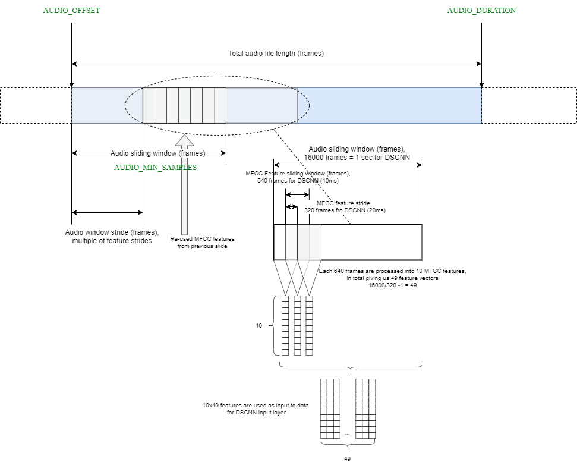
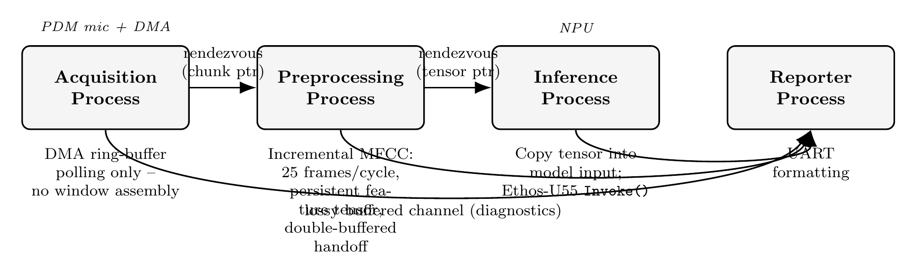
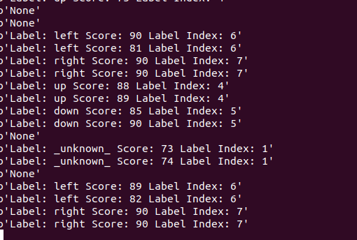

# CSP4CMSIS based KeyWord Spotting using Transformers

KeyWord Spotting (KWS) is a technique used to detect specific words within a stream of audio data, typically in low-power, always-on settings. This `scenario_app` utilizes ARM's [KeyWord Transformer](https://www.isca-archive.org/interspeech_2021/berg21_interspeech.pdf) model to perform KWS on the Grove Vision AI v2 board.

The audio data preprocessing is inspired by ARM's [ml-embedded-evaluation_kit](https://review.mlplatform.org/plugins/gitiles/ml/ethos-u/ml-embedded-evaluation-kit/+/refs/tags/22.02/docs/use_cases/kws.md), which involves converting raw audio into MFCC features as shown below [reference here](https://review.mlplatform.org/plugins/gitiles/ml/ethos-u/ml-embedded-evaluation-kit/+/refs/heads/main/docs/media/KWS_preprocessing.png):



This repository extends the original single-task `kws_pdm_record` app into a **concurrent, CSP-based pipeline** built with [CSP4CMSIS](https://oliverfaust.github.io/CSP4CMSIS/), doubling the inference rate from 2 Hz to a genuine 4 Hz with **zero missed inferences** measured over 180 consecutive cycles. See below for the architecture, the measured results, and a required one-line SDK patch.

---

## 🚀 Concurrency with CSP4CMSIS

The original app ran audio acquisition, feature extraction, and NPU inference sequentially in a single task: capture → MFCC → `Invoke()` → report, in strict order, once per cycle. That single-threaded design leaves the CPU idle while the NPU runs, and leaves the NPU idle while the CPU captures and featurizes the next window.

This version restructures the app as a **four-process CSP network**, using [CSP4CMSIS](https://oliverfaust.github.io/CSP4CMSIS/)'s Communicating Sequential Processes model on top of FreeRTOS. Each process is an independent, statically-allocated task communicating exclusively through typed channels — no shared mutable state, no manual locking:

| Process | Responsibility |
|---|---|
| **AcquisitionProcess** | Owns the PDM/DMA ring buffer; hands a raw pointer to each freshly-completed 0.25 s audio segment onward — no window assembly. |
| **PreprocessingProcess** | Maintains a **persistent, incrementally-updated** 98-frame MFCC feature tensor, shifting in exactly 25 new frames (one segment's worth) per cycle, double-buffered against Inference. |
| **InferenceProcess** | Copies the completed tensor into the model's input, runs the Ethos-U55 NPU via `Invoke()`, and classifies the result. |
| **ReporterProcess** | Owns all UART/console output via a lossy, non-blocking channel, so slow console I/O can never stall acquisition or inference. |

### Process Network Diagram



Acquisition → Preprocessing and Preprocessing → Inference are **zero-capacity rendezvous channels**: each side blocks until the other is ready, and a pointer — not a copy — is handed across. Both of those two processes, plus Inference, report diagnostics to Reporter over a shared **lossy, buffered channel** (`SamplingBufferedChannel`, keep-newest policy), so a burst of print activity can never propagate backpressure into the acquisition/inference path.

Double buffering is what makes the pipelining safe: PreprocessingProcess can start building the *next* feature tensor while InferenceProcess is still blocked inside the *current* `Invoke()` call, because the two sides ping-pong between two statically-allocated tensor buffers — the same technique originally used for whole audio windows, applied one level finer to feature extraction itself.

---

## ⚡ Speedup: 4 Hz Instead of 2 Hz

| Design | Inference rate | Missed inferences | Miss rate |
|---|---|---|---|
| Original single-task app | 2 Hz | 0 / 33,440 | 0% |
| Initial 3-stage CSP pipeline | 4 Hz | 2 / 140 | 1.4% |
| **This repo: double-buffered 4-stage pipeline** | **4 Hz** | **0 / 180** | **0%** |

The NPU itself (`Invoke()`, ≈240 ms) already fits comfortably inside a 250 ms budget — the original bottleneck was MFCC feature extraction (≈13.6 ms) sitting serialized *ahead of* `Invoke()` in the same task's critical path, pushing the true cycle time just over budget. Moving feature extraction into its own double-buffered process removes that serialized cost from the inference path entirely (rather than merely shrinking it), which is the difference between a small, slowly-accumulating miss rate and a genuinely bounded margin every cycle. NPU utilization rises from ≈48% (original 2 Hz design) to ≈94% (this pipeline), and steady-state audio-to-classification latency increases from ≈0.25 s to ≈0.5 s as the accepted cost of the extra pipeline stage.

---

## 🩹 Required SDK Patch: `fully_connected_common.cc`

Building this app requires one small patch to the TFLite Micro kernel sources shipped with the SDK, under
`library/inference/<your_tflm_tag>/tensorflow/lite/micro/kernels/fully_connected_common.cc`.

The file has an existing guard that skips a symmetric-quantization assertion for the original `KWS_PDM_RECORD` app type:

```cpp
// Filter weights will always be symmetric quantized since we only support
// int8 quantization. See
// https://github.com/tensorflow/tensorflow/issues/44912 for additional
// context.
#if defined(KWS_PDM_RECORD)

#else
  TFLITE_DCHECK(filter->params.zero_point == 0);
#endif
```

This app compiles with `-DCSP4CMSIS_KWS_PDM_RECORD` rather than `-DKWS_PDM_RECORD`, so the existing guard doesn't recognise it and the assertion fires. Extend the guard to include the new app type:

```cpp
// Filter weights will always be symmetric quantized since we only support
// int8 quantization. See
// https://github.com/tensorflow/tensorflow/issues/44912 for additional
// context.
#if defined(KWS_PDM_RECORD) || defined(CSP4CMSIS_KWS_PDM_RECORD)

#else
  TFLITE_DCHECK(filter->params.zero_point == 0);
#endif
```

Without this patch, the build either fails the assertion or aborts at runtime on the first fully-connected layer invoke, depending on your build configuration.

---

## 🔧 Key Code Snippets

### Acquisition → Preprocessing handoff (`csp4cmsis_spn.cpp`)
```cpp
struct AudioChunkMsg {
    const int16_t *chunk;   // points directly into audio_buf[slot]
};
static Channel<AudioChunkMsg> g_audioChan;   // capacity-0 rendezvous

class AcquisitionProcess : public CSProcess {
    Chanout<AudioChunkMsg> out;
public:
    void run() override {
        while (true) {
            while (w_buf_idx == last_current_buf) { vTaskDelay(1); }
            int32_t current_buf = w_buf_idx;

            SCB_InvalidateDCache_by_Addr((uint32_t*)audio_buf[current_buf], QUARTER_SECOND_MONO_BYTES);

            AudioChunkMsg msg{ audio_buf[current_buf] };
            out << msg;   // blocks iff PreprocessingProcess is still busy

            last_current_buf = current_buf;
        }
    }
};
```

### Incremental MFCC with a persistent tensor (`cvapp_kws.cpp`)
```cpp
void* cv_kws_preprocess_step(const int16_t *newQuarterBuffer) {
    // Prepend the 320-sample tail carried from the previous call, so each
    // new frame has the lookback samples it needs.
    std::memcpy(scratch, g_pp_tail, kPPTailSamples * sizeof(int16_t));
    std::memcpy(scratch + kPPTailSamples, newQuarterBuffer, kPPNewSamplesPerStep * sizeof(int16_t));

    ShiftAndAppendFrames(scratch);   // shift tensor by 25 rows, compute + append 25 new ones

    std::memcpy(g_pp_tail, newQuarterBuffer + (kPPNewSamplesPerStep - kPPTailSamples),
                kPPTailSamples * sizeof(int16_t));

    if (g_pp_frames_populated < kNumRows) return nullptr;   // window not yet fully real

    g_pp_handoff_slot ^= 1;   // ping-pong double buffer
    std::memcpy(g_pp_handoff[g_pp_handoff_slot].data(), g_pp_working.data(), g_pp_tensor_bytes);
    return g_pp_handoff[g_pp_handoff_slot].data();
}
```

### Network construction (`csp4cmsis_spn.cpp`)
```cpp
void MainApp_Task(void* params) {
    cv_kws_preprocess_init();

    // InferenceProcess MUST be first: CSP4CMSIS's InParallel(...) runs
    // argument 0 on the calling task's own stack/priority, and every other
    // process gets a hardcoded 256-word stack -- Inference has by far the
    // deepest call chain (TFLM -> CMSIS-NN -> Ethos-U driver).
    static InferenceProcess inference(g_featureChan.reader());
    static PreprocessingProcess preprocessing(g_audioChan.reader(), g_featureChan.writer());
    static AcquisitionProcess acquisition(g_audioChan.writer());
    static ReporterProcess reporter(g_reportChan.reader());

    Run(
        InParallel(inference, preprocessing, acquisition, reporter),
        ExecutionMode::StaticNetwork
    );
}
```

---

## Download the Project by Cloning This Repository

- To ensure all submodules are cloned, use the `--recursive` flag:
    ```bash
    git clone --recursive https://github.com/HimaxWiseEyePlus/Seeed_Grove_Vision_AI_Module_V2.git
    ```

## Building the `csp4cmsis_kws_pdm_record` Scenario App and Running it on WE2

### Linux Environment

1. Apply the [`fully_connected_common.cc` patch](#-required-sdk-patch-fully_connected_commoncc) described above.

2. Change the `APP_TYPE` to `csp4cmsis_kws_pdm_record` in the [Makefile](https://github.com/HimaxWiseEyePlus/Seeed_Grove_Vision_AI_Module_V2/blob/main/EPII_CM55M_APP_S/makefile):
    ```makefile
    APP_TYPE = csp4cmsis_kws_pdm_record
    ```

3. Build the firmware. Refer to the section on [Building the Firmware in a Linux Environment](https://github.com/HimaxWiseEyePlus/Seeed_Grove_Vision_AI_Module_V2?tab=readme-ov-file#build-the-firmware-at-linux-environment) for details.

4. Compile the firmware and generate the firmware image file.

5. Flash the firmware to the Grove Vision AI v2. For instructions, see [Flashing Image Updates in a Linux Environment Using Python](https://github.com/HimaxWiseEyePlus/Seeed_Grove_Vision_AI_Module_V2?tab=readme-ov-file#flash-image-update-at-linux-environment-by-python-code). Currently, the model is stored at flash address `0x3AB7B000`. Use the following command to flash the firmware image to the board:

    ```bash
    python3 xmodem/xmodem_send.py --port=/dev/ttyACM0 --baudrate=921600 --protocol=xmodem --file=we2_image_gen_local/output_case1_sec_wlcsp/output.img --model="model_zoo/kws_pdm_record/kwt1_relu_mfcc_fvp_aligned_vela.tflite 0xB7B000 0x00000"
    ```

6. Press the `reset` button on the Grove Vision AI V2.

7. You should now see the KeyWord Spotting application running in your terminal, now reporting from four independent processes:

    ```text
    --- KWS Processing (4-process pipeline: Acquisition | Preprocessing | Inference | Reporter) ---
    Preprocessing state initialised: tensor_bytes=3920 type=9
    Preprocessing: priming step 1/3 (window not yet fully real)
    Preprocessing: priming step 2/3 (window not yet fully real)
    Preprocessing: priming step 3/3 (window not yet fully real)
    Label: up Score: 89 %  Label Index: 4
    [Acq]  Missed 0/20 | ms: dma_wait=4817 buf_asm=0 chan_send_wait=0 | elapsed=4819 ms | rt=1.03x
    [Prep] Processed 20 | ms: mfcc=61 chan_send_wait=4080 | elapsed=5063 ms | rt=0.98x
    [Inf]  Processed 20 | ms: copy=0 invoke=4800 post=0 | elapsed=5830 ms | rt=0.85x
    ```



---

## 📁 File Structure

```text
app/scenario_app/csp4cmsis_kws_pdm_record/
├── csp4cmsis_kws_pdm_record.c   // PDM/DMA driver glue, ring-buffer ISR callback
├── csp4cmsis_kws_pdm_record.h   // Ring-buffer sizing (BLK_NUM, NUM_BUFF, AUDIO_LEN)
├── cvapp_kws.cpp                // Model init, MFCC (incremental + legacy paths), Invoke()
├── cvapp_kws.h                  // cv_kws_* API, timing globals
├── csp4cmsis_spn.cpp            // The 4 CSP processes + network construction
└── csp4cmsis_spn.h              // Reporting API shared across processes
```

## 🐛 Troubleshooting

* **Reporter process never prints anything, but the app doesn't crash** — Priority/stack starvation. CSP4CMSIS's `InParallel(...)` runs argument 0 on the calling task's own priority and every other process at a fixed, lower priority; a spin-wait in the higher-priority process (e.g. `while(!flag);`) never yields to a strictly lower-priority one. Use `vTaskDelay(1)`, not `taskYIELD()` (which only rotates same-priority tasks).
* **Timing measurements wrap to a huge (~4 billion) value** — A raw `SysTick`-based cycle counter was used across a genuine RTOS blocking wait (e.g. around `Invoke()`). Use `xTaskGetTickCount()`/`portTICK_PERIOD_MS` for any measurement that spans a blocking call; raw cycle counters are only safe for phases that never block.
* **Classification results look wrong / model seems to be fed stale audio** — Check that `BLK_NUM` (in `csp4cmsis_kws_pdm_record.h`) and the window-assembly logic agree on how many samples one DMA chunk actually represents. A mismatch here silently feeds the model a partly-stale window without any compile or runtime error.
* **Build fails or asserts inside `fully_connected_common.cc`** — See the [required SDK patch](#-required-sdk-patch-fully_connected_commoncc) above.

## 📝 License
This example is provided under the standard Himax SDK license terms. Refer to the top‑level license file in the SDK for details.
